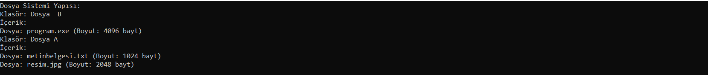

# dosya sistemi nesne hiyerarşisi
Bu C++ programı, basit bir dosya sistemi nesne hiyerarşisi üzerinde çalışan bir örnek sunmaktadır. 

# FileSystemObject Hiyerarşisi

*Bu C++ programı, basit bir dosya sistemi nesne hiyerarşisi üzerinde çalışan bir örnek sunmaktadır. FileSystemObject temel sınıfından türetilmiş File ve Folder sınıfları kullanılarak bir dosya sistemi oluşturulmaktadır.*

# Temel Sınıf: `FileSystemObject`
- `FileSystemObject` sınıfı, temel dosya sistemi nesnesini temsil eder.
- Her dosya veya klasör, isim özelliğine sahiptir ve bu sınıf tarafından sağlanan temel özellikleri içerir.
- `display` fonksiyonu saf sanal bir fonksiyondur, bu nedenle türetilen sınıflarda uyarlanmalıdır.

# Türetilmiş Sınıf: `File`
- `File` sınıfı, `FileSystemObject` sınıfından türetilmiştir ve dosyaları temsil eder.
- Bir dosya, adı ve boyutu ile belirlenir.
- `display` fonksiyonu, dosyanın adını ve boyutunu ekrana yazdırır.

# Türetilmiş Sınıf: `Folder`
- `Folder` sınıfı, `FileSystemObject` sınıfından türetilmiştir ve klasörleri temsil eder.
- `Folder` içinde bulunan dosyaları ve alt klasörleri depolamak için bir vektör kullanır.
- `addFile` fonksiyonu, bir dosya veya klasörü eklemek için kullanılır.
- `addFile` fonksiyonu, bir dosya veya klasörü eklemek için kullanılır alt klasörlerin display fonksiyonlarını çağırarak içeriğini gösterir.
   - `setlocale(LC_ALL, "Turkish");` ifadesi ile Türkçe karakter desteği sağlanır.

# Örnek Kullanım
- main fonksiyonu, birkaç dosya ve klasör oluşturarak bir dosya sistemi yapısı oluşturur.
- Dosya sistemi yapısı, `display` fonksiyonu kullanılarak ekrana yazdırılır.

**Bu örneği kullanarak, basit bir dosya sistemi nesne yapısı oluşturabilir ve dosya ve klasörler arasındaki ilişkiyi gözlemleyebilirsiniz.**

# Ekran Resmi

# Bilgilendirme
**---------------------------------------------------------**
| Herkese Açık | Geliştirilebilir | Zyra Software|
|---------|---------|---------|
| Açık | Geliştirilebilir |@zyrasoftware |

